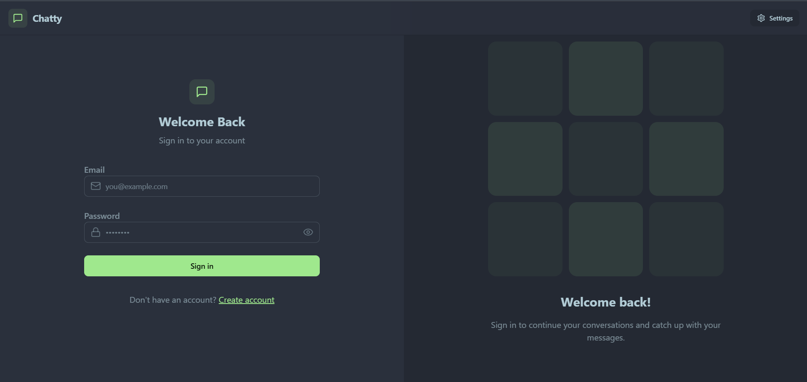

# 🚀 Real-Time Chat App

This project is a fully functional real-time chat application that allows users to communicate seamlessly through an intuitive and responsive interface. It leverages modern web technologies and real-time communication protocols to deliver an engaging user experience.

## 🌍 Live Demo
🔗 [Check out the live app here!](https://real-time-chat-app-djx2.onrender.com)

---

## ✨ Key Features
- 💬 **Real-time Messaging:** Instant communication using WebSocket-based architecture.
- 🔐 **User Authentication:** Secure login and registration using JWT.
- 💕 **Private Chats:** One-to-one messaging.
- 📸 **Share Images:** Send and receive image files in chats.
- 🟢 **User Presence:** Displays online/offline status.
- 🎨 **DaisyUI Themes:** Choose from 32 beautiful themes for a personalized experience.
- 📱 **Responsive Design:** Optimized for both desktop and mobile users.

---

## 🛠️ Tech Stack
- **Frontend:** React.js,Tailwind CSS, DaisyUI 🌼
- **Backend:** Node.js, Express.js
- **Database:** MongoDB 🍃
- **Real-Time Communication:** Socket.io ⚡
- **Authentication:** JSON Web Tokens (JWT) 🔑
- **Deployment:** Render 🌐

---

## 🛸 Installation and Setup

### Prerequisites
Ensure you have the following installed:
- 🛠️ Node.js
- 🍃 MongoDB

### Steps to Run Locally
1. **Clone the repository:**
   ```bash
   git clone https://github.com/jan257/Real-Time-Chat-App.git
   cd Real-Time-Chat-App
   ```

2. **Install dependencies:**
   ```bash
   npm install 
   cd frontend
   npm install
   cd ..
   ```

3. **Environment Variables:**
   Create a `.env` file in the root directory and add the following:
   ```env
   MONGODB_URI=...
  PORT=5001
  JWT_SECRET=...

  CLOUDINARY_CLOUD_NAME=...
  CLOUDINARY_API_KEY=...
  CLOUDINARY_API_SECRET=...

  NODE_ENV=development
   ```

4. **Build the application:**
   ```bash
   npm run build
   ```

5. **Start the application:**
   ```bash
   npm run start
   ```

6. **Access the application:**
   Navigate to `http://localhost:5001` in your browser. 🖥️

---

## 📸 Screenshots
### 🌟 Home Page


### 💬 Chat Interface


(Note: Add actual screenshots to your `screenshots` folder)

---

## 📁 Folder Structure
```
Real-Time-Chat-App/
├── backend/        # Express backend
│   ├── controllers/
│   ├── lib/
│   ├── middleware/
│   ├── models/
│   ├── routes/
│   ├── seeds/
│   ├── index.js
│   ├── package.json
│   └── package-lock.json
├── frontend/        # React frontend
│   ├── public/
│   ├── src/
│   │   ├── components/
│   │   ├── constants/
│   │   ├── lib/
│   │   ├── pages/
│   │   ├── store/
│   │   ├── App.jsx
│   │   ├── index.css
│   │   └── main.jsx
│   ├── README.md
│   ├── eslint.config.js
│   ├── index.html
│   ├── package.json
│   └── vite.config.js
```

---

## 🤝 Contribution
Contributions are welcome! Please follow these steps:
1. 🍴 Fork the repository.
2. 🌿 Create a feature branch (`git checkout -b feature/your-feature`)
3. 💾 Commit your changes (`git commit -m 'Add new feature'`)
4. 📤 Push to the branch (`git push origin feature/your-feature`)
5. 🔄 Open a pull request.

---

## 📝 License
This project is licensed under the MIT License. See the [LICENSE](LICENSE) file for details.

---

## 📧 Contact
For any inquiries or issues, please reach out via [jan257](mailto:your-email@example.com) or create an issue in this repository.

